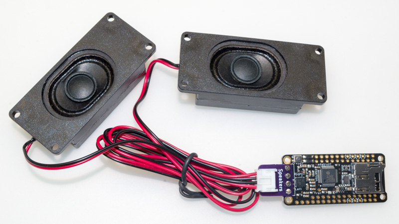
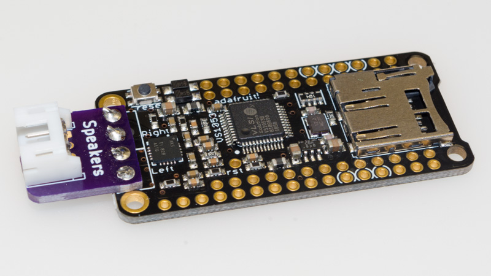
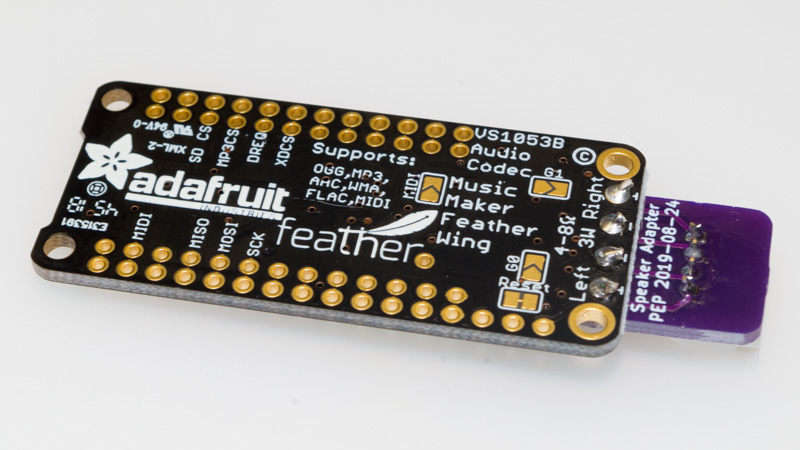

This is a small adapter board (created with [KiCad][1] 5) which lets
you connect [these speakers][2] to the
[Music Maker FeatherWing with Amp][3] without having to cut the JST-PH
connector off of the speakers.  This tiny board solders onto the Music
Maker FeatherWing, giving it a JST-PH connector, instead of terminal
blocks.

[Order board from OSH Park][5] ($1.70 for three copies of the board, with free shipping)

## Bill of Materials

* [Horizontal JST-PH connector][4]
* Four short lengths of solid bare wire (I used 20 AWG)

## Instructions

Place the adapter board on top of the spot on the Music Maker
FeatherWing where the terminal blocks are supposed to go.  Solder
short lengths of wire into each of the four holes, connecting the two
boards together.  Then, solder the JST-PH connector in place.

[1]: http://kicad.org/
[2]: https://www.adafruit.com/product/1669
[3]: https://www.adafruit.com/product/3436
[4]: https://www.digikey.com/products/en?keywords=455-1721-ND
[5]: https://oshpark.com/shared_projects/vhWQE0V6
